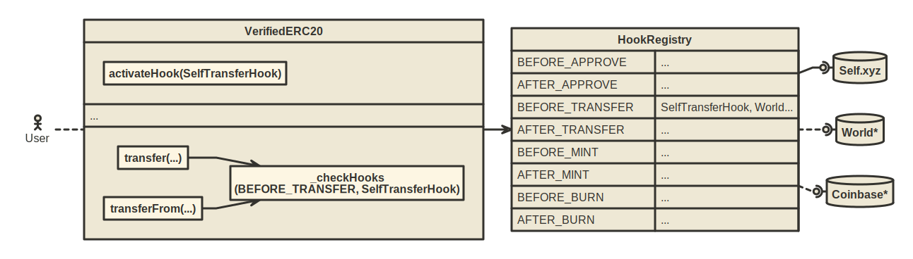

# VerifiedERC20

ERC20 tokens support for onchain verifications using hooks.

  

> Remember when, ~~on the internet~~ onchain, nobody knew who you were?

A joint experiment by Velodrome, [Self.xyz](https://self.xyz) and [Celo](https://celo.org) teams. Audit by [ChainSecurity](https://chainsecurity.com).

Illustration by <a href="https://x.com/kaamranhafeez">Hafeez</a>. Originally
published in The New Yorker February 23rd, 2015.

## Why

Onchain verifications allow us to optimize DeFi for actual humans:
* Reward actual users over bots
* Prove DeFi is ready for legal frameworks (see GENIUS Act in US and MiCA in EU)
* Build better alternatives to KYC using ZK proofs and blockchain

All, and more, while preserving the existing DeFi composable and immutable!

## How

We've extended the OpenZeppelin ERC20 implementation to support hooks for
relevant function calls.
We've also introduced a registry where token issuers can find available hooks
(if they choose to use existing ones).

Token issuers can deploy new tokens using this implementation, which by default
behave as regular ERC20 tokens.

They can enable or disable additional hooks in order to enable external
verifications for specific function calls.

Once activated, a hook can perform checks before or after a function call.

You can think of this as a layers of verifications, eg:
* Check the transfer destination for OFAC restrictions
* Enable US jurisdiction checks on new mints
* Check the age of the wallet before any allowances

Every hook is a simple smart contract with a name, and a function called `check()`.

## I'd like to learn more

Please follow the Velodrome and Celo for updates on the experiment.

In the meantime, please take a look around and let us know if you have any
feedback by opening an issue here or by reaching out on our Discord servers.

## Development

Basic Foundry project, uses:
- bulloak for branching test tree structure
- foundry for compilation and testing
- forge fmt for formatting
- forge test for tests (including gas tests)
